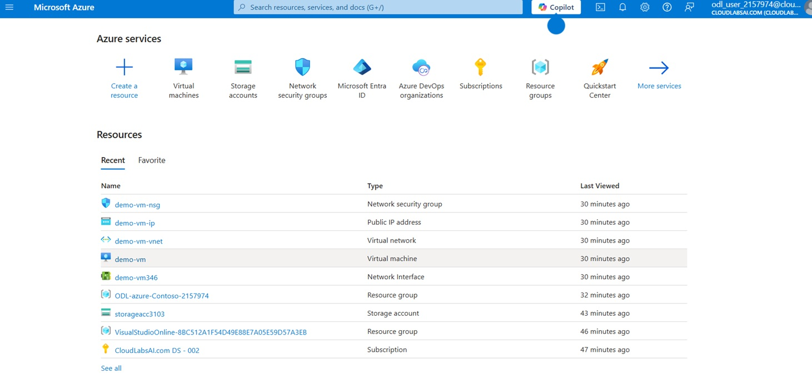
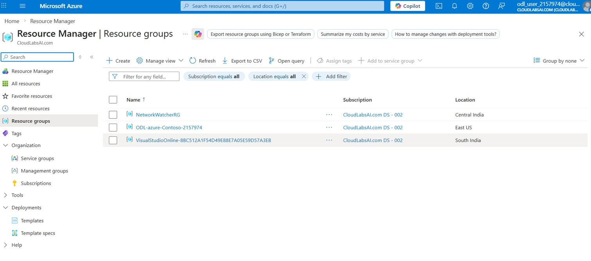
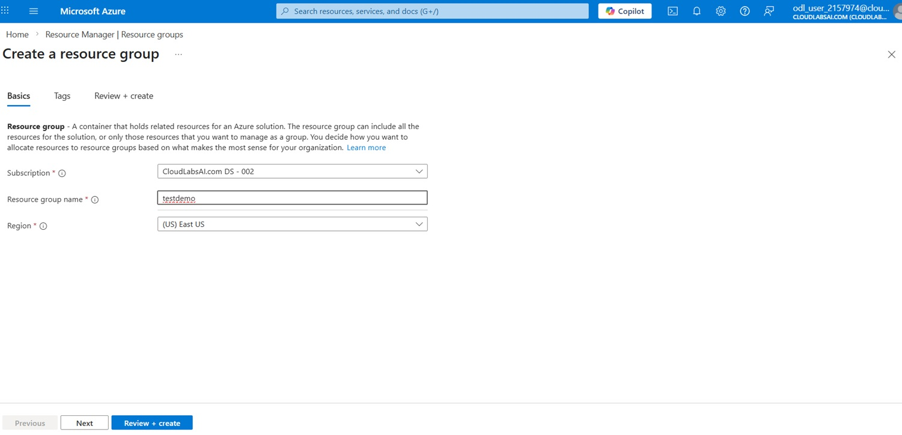
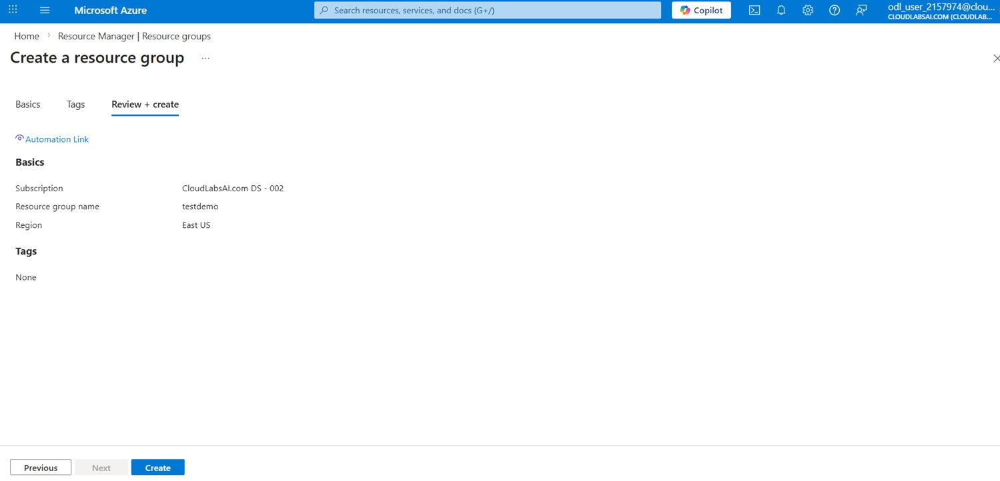
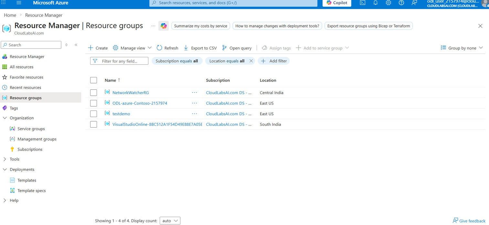

# Exercise 1: Create a Resource Group

## 🎯 Objective

Create a logical container to organize Azure resources.

---

## Steps

### Step 1: Open Azure Portal

- Navigate to https://portal.azure.com
- Sign in to your account

  

  
  
<em>Azure Portal Dashboard</em>

  

---

### Step 2: Create Resource Group

- Click **Create a resource**
- Search for **Resource Group**
- Click **Create**

  

  
  
<em>Create Resource Group Page</em>

  
  

---

### Step 3: Configure Resource Group

- Subscription: Select your subscription  
- Resource Group Name: `testdemo`  
- Region: Select nearest region  

  

  
  
<em>Resource Group configuration</em>

  
  
  

---

### Step 4: Review and Create

- Click **Review + Create**
- Click **Create**

  

  
  
<em>Review + Create page</em>

  
 
   

---

### Step 5: Verify Deployment

- Navigate to **Resource Groups**
- Open the created resource group

  

  
  
<em>Resource Group created successfully</em>

  
   
  