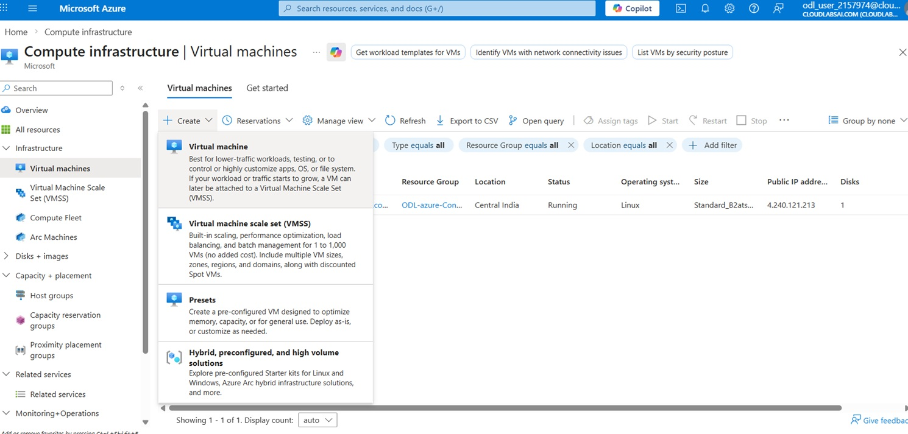
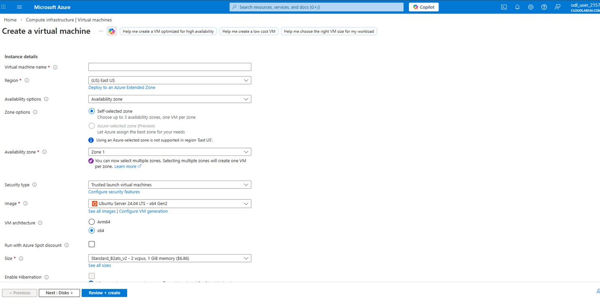
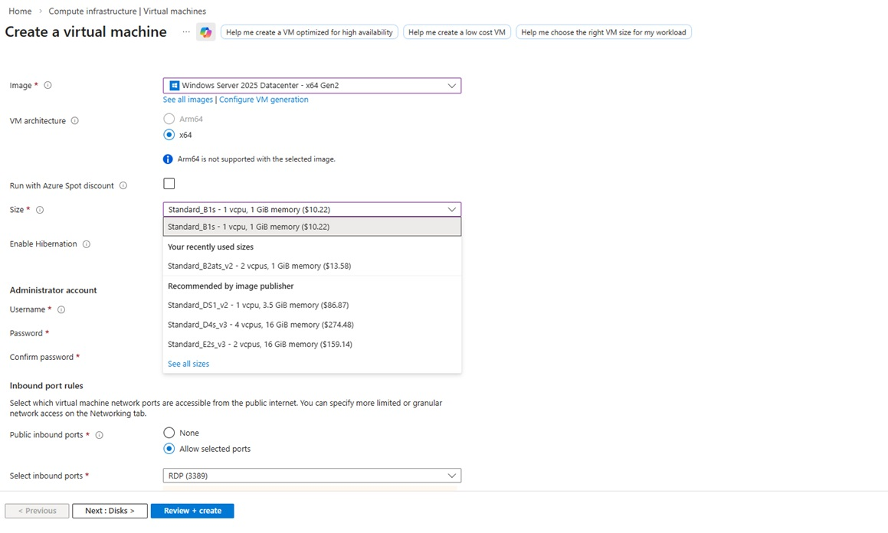
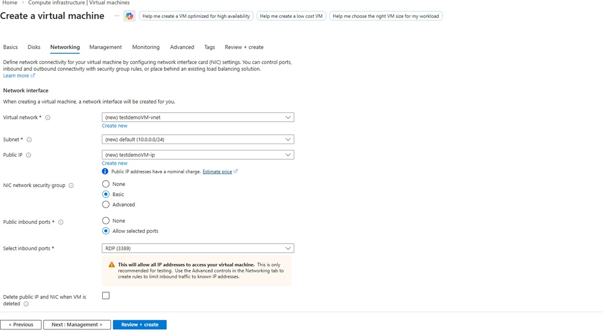
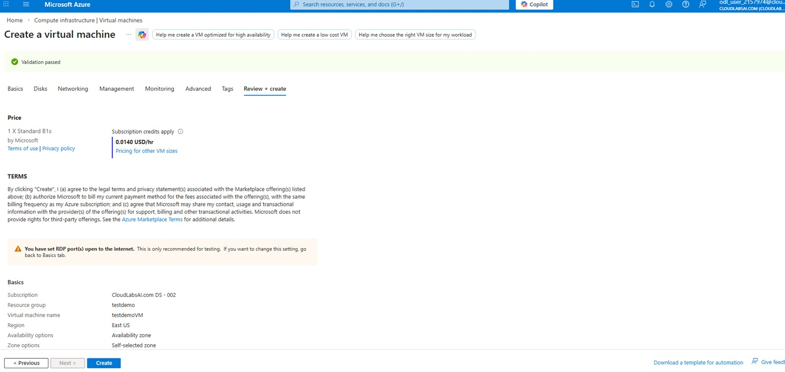
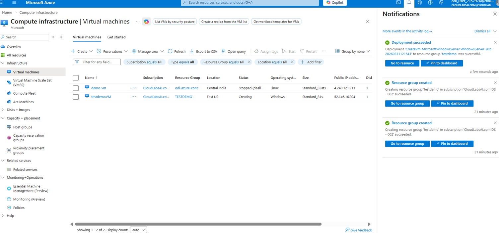
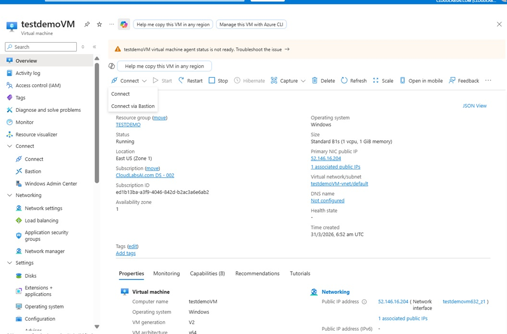

# Exercise 2: Create a Virtual Machine

## 🎯 Objective

Deploy and connect to a Virtual Machine.

---

## Steps

### Step 1: Start VM Creation

- Click **Create a resource**
- Select **Virtual Machine**

  

  
  
<em>Virtual Machine Creation Page</em>

  
  

---

### Step 2: Configure Basics

- Resource Group: `testdemo`
- VM Name: `testdemoVm`
- Region: Same as RG
- Image: Windows Server / Ubuntu
- Username and Password

  

  
  
<em>VM basic configuration</em>

  
  
   

---

### Step 3: Select Size

- Choose **Standard B1s**

  

  
  
<em>VM size selection</em>

  
    

---

### Step 4: Configure Networking

- Public IP: Enabled  
- Allow inbound ports: RDP (3389) / SSH (22)

  

  
  
<em>Networking tab</em>

  
  

---

### Step 5: Review and Create

- Click **Review + Create**
- Click **Create**

  

  
  
<em>Review page</em>

  
  

---

### Step 6: Deployment Completion

- Wait for deployment
- Click **Go to resource**

  

  
  
<em>Deployment Success</em>

  
  

---

### Step 7: Connect to VM

- Click **Connect**
- Use browser-based connection

  

  
  
<em>Connecting to VM via browser</em>

  
  
   