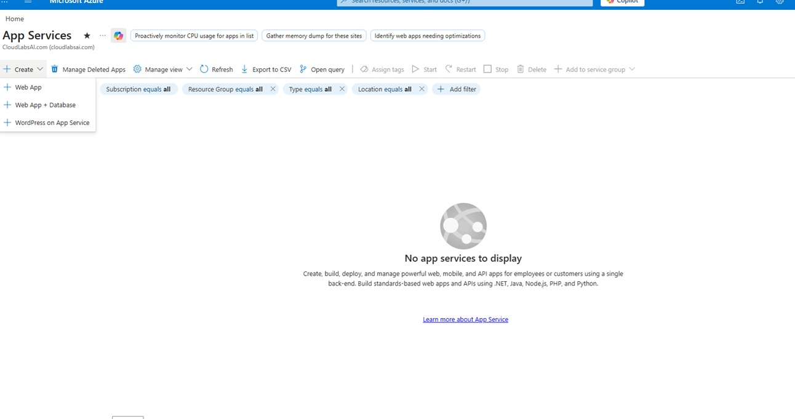
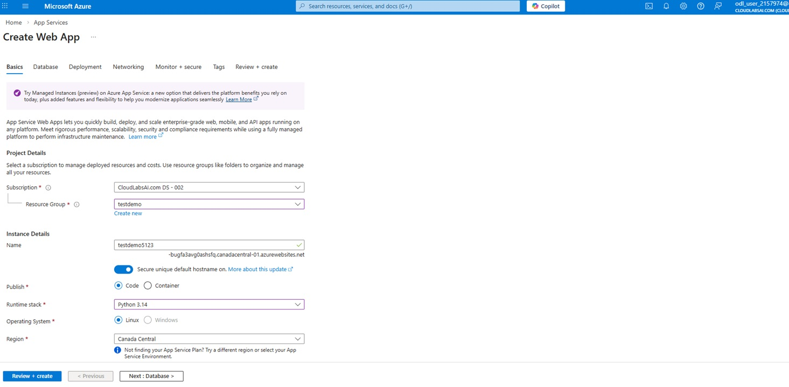
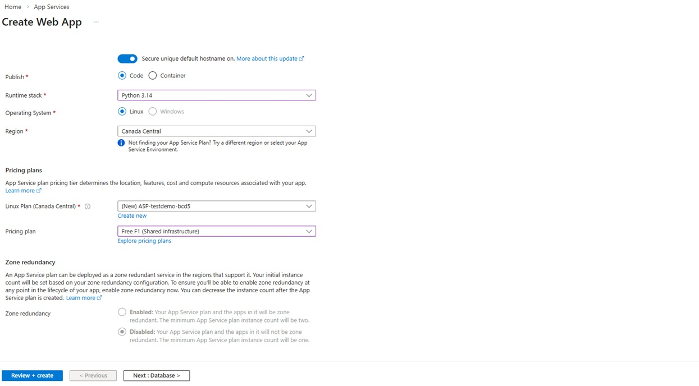
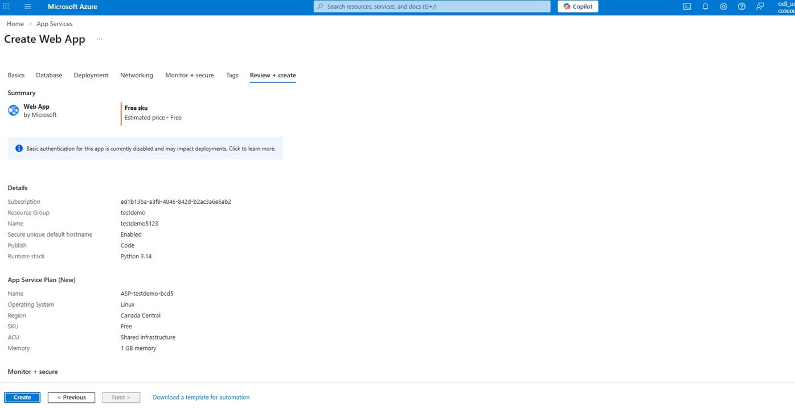
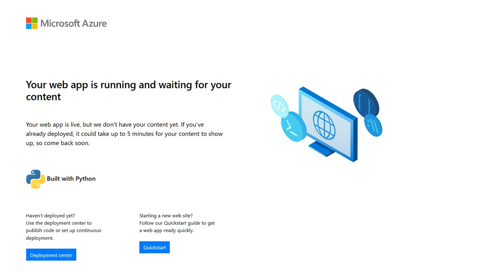

# Exercise 3: Create a Web App

## 🎯 Objective

Deploy a web application using Azure App Service.

---

## Steps

### Step 1: Create Web App

- Click **Create a resource**
- Select **Web App**

  

  
  
<em>Web App Creation page</em>

  
    

---

### Step 2: Configure Basics

- Resource Group: `testdemo`
- App Name: Unique name ex:`testdemo5123`
- Runtime Stack: Node / .NET / PHP

  

  
  
<em>Web App Basics tab</em>

  
    

---

### Step 3: Configure App Service Plan

- Select Free Tier (F1)

  

  
  
<em>Web App Basics Service plan</em>

  

---

### Step 4: Review and Create

- Click **Create**

  

  
  
<em>Review page</em>

  
  

---

### Step 5: Access Web App

- Go to resource
- Click **Browse**

  

  
  
<em>Web App running successfully</em>

  
 
