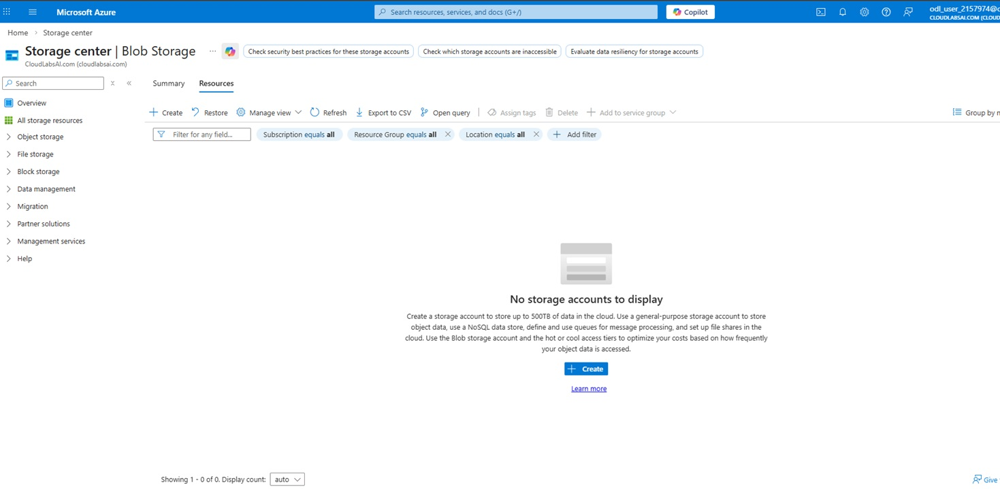
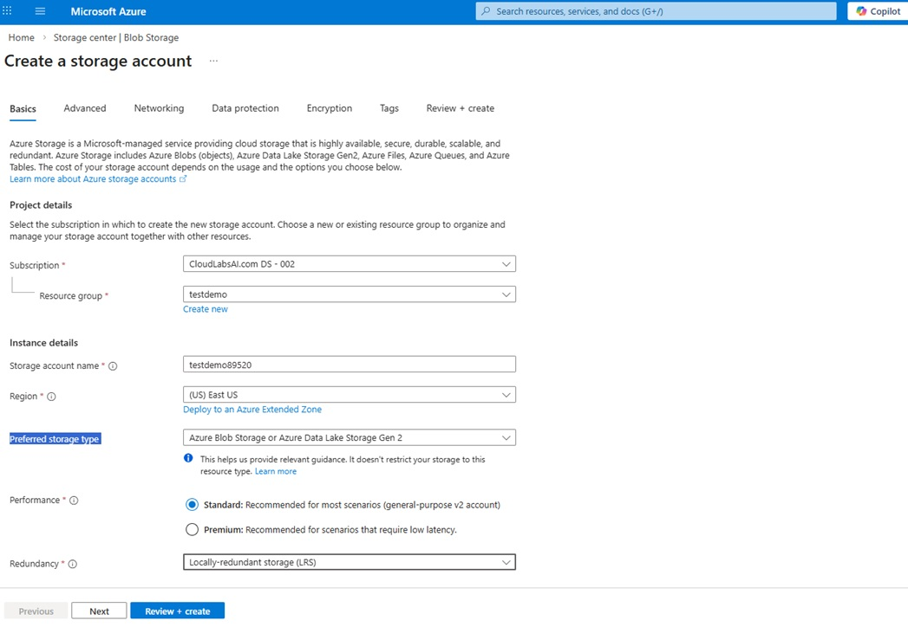
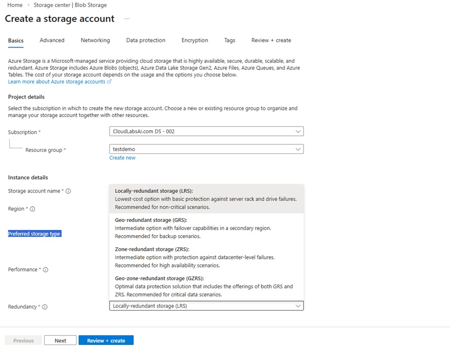
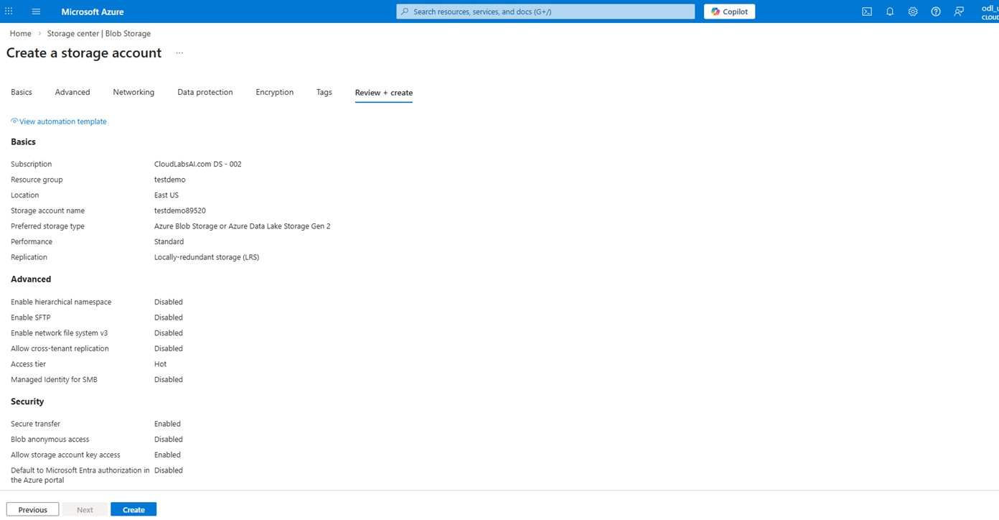
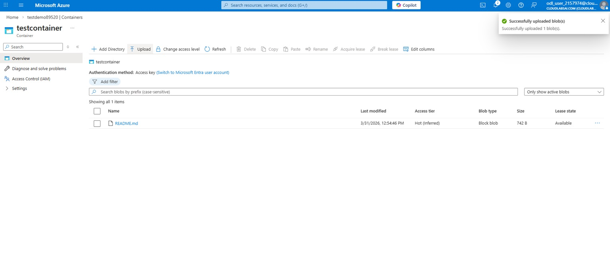

# Exercise 4: Create a Storage Account

## 🎯 Objective

Create storage and upload a file.

---

## Steps

### Step 1: Create Storage Account

- Click **Create a resource**
- Select **Storage Account**

  

  
  
<em>Storage Account creation page</em>

  
   

---

### Step 2: Configure Basics

- Name: Unique name ex: `testdemo89520`
- Region: Same as RG
- Performance: Standard

  

  
  
<em>Basics tab</em>

  
   

---

### Step 3: Configure Redundancy

- Select **LRS**

  

  
  
<em>Redundancy options</em>

  
   

---

### Step 4: Review and Create

  

  
  
<em>Review page</em>

  
   

---

### Step 5: Upload File

- Go to Storage Account
- Click **Containers**
- Create container
- Upload file

  

  
  
<em>File uploaded successfully</em>

  
   
   