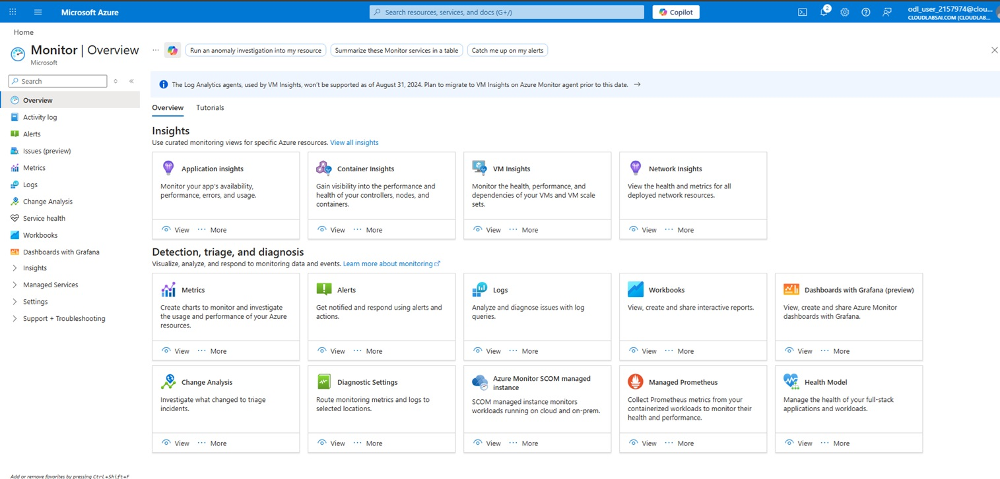
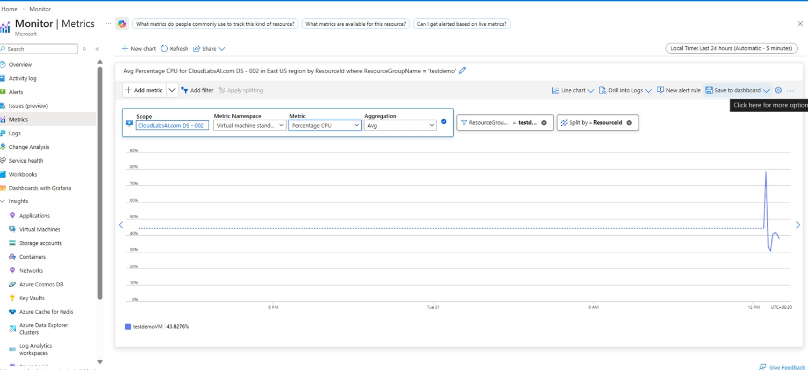
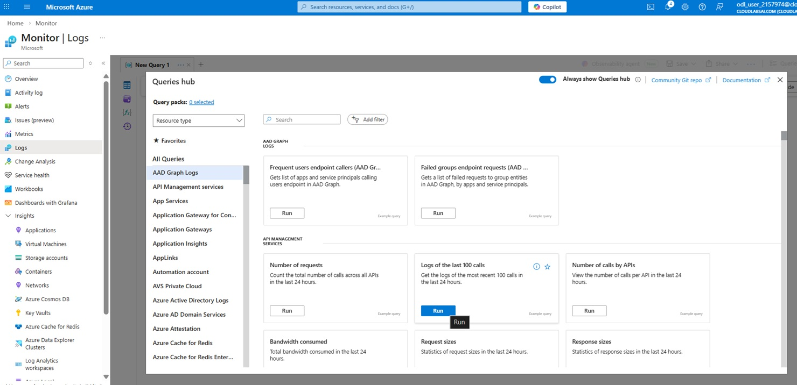
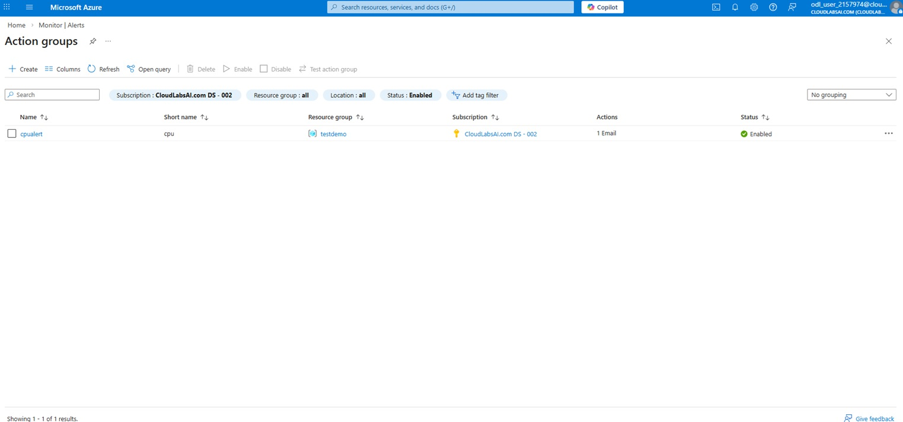

# Exercise 5: Monitor Resources

## 🎯 Objective

Monitor resources using Azure Monitor.

---

## Steps

### Step 1: Open Azure Monitor

- Search **Monitor**

  

  
  
<em>Azure Monitor Dashboard</em>

  
   

---

### Step 2: View Metrics

- Select VM
- View CPU usage

  

  
  
<em>CPU utilization</em>

  
   
  

---

### Step 3: Use Logs

- Open **Logs**
- Run query

  

  
  
<em>Logs query page</em>

  
   

---

### Step 4: Create Alerts

- Create Alert Rule
- Select condition

  

  
  
<em>Alert Creation</em>

  
   