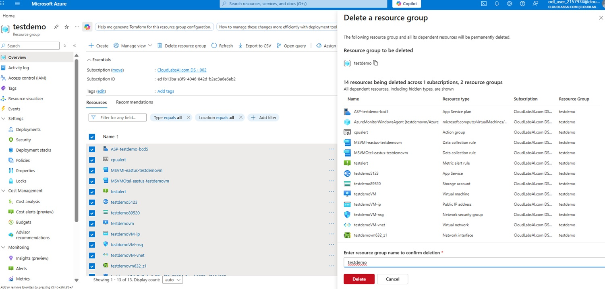
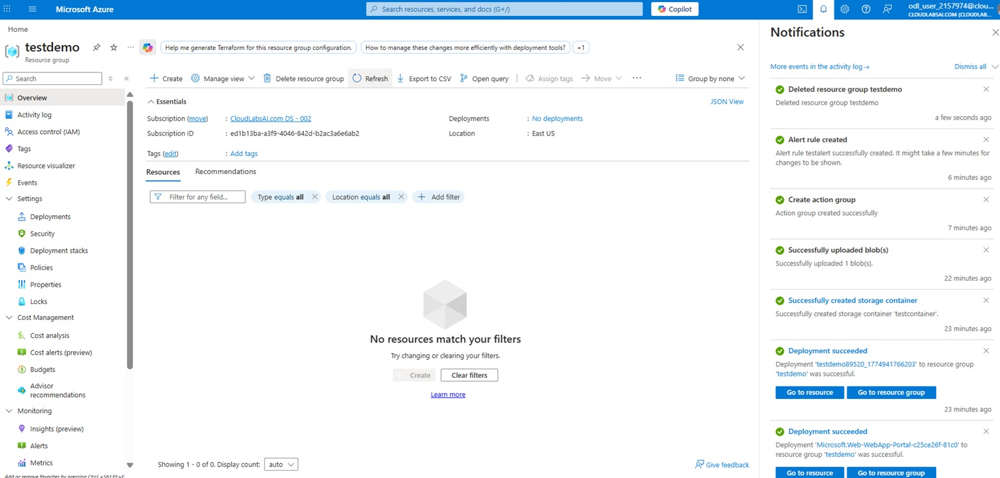

# Exercise 6: Cleanup Resources

## 🎯 Objective

Delete resources to avoid cost.

---

## Steps

### Step 1: Delete Resource Group

- Go to Resource Groups
- Select `rg-demo-az900`
- Click **Delete**

📸 Screenshot: Delete option  

---

### Step 2: Confirm Deletion

- Type resource group name
- Click Delete

  

  
  
<em>Confirmation page</em>

  
   

---

### Step 3: Verify Cleanup

- Ensure no resources remain

  

  
  
<em>Cleanup completed</em>

  
   
   